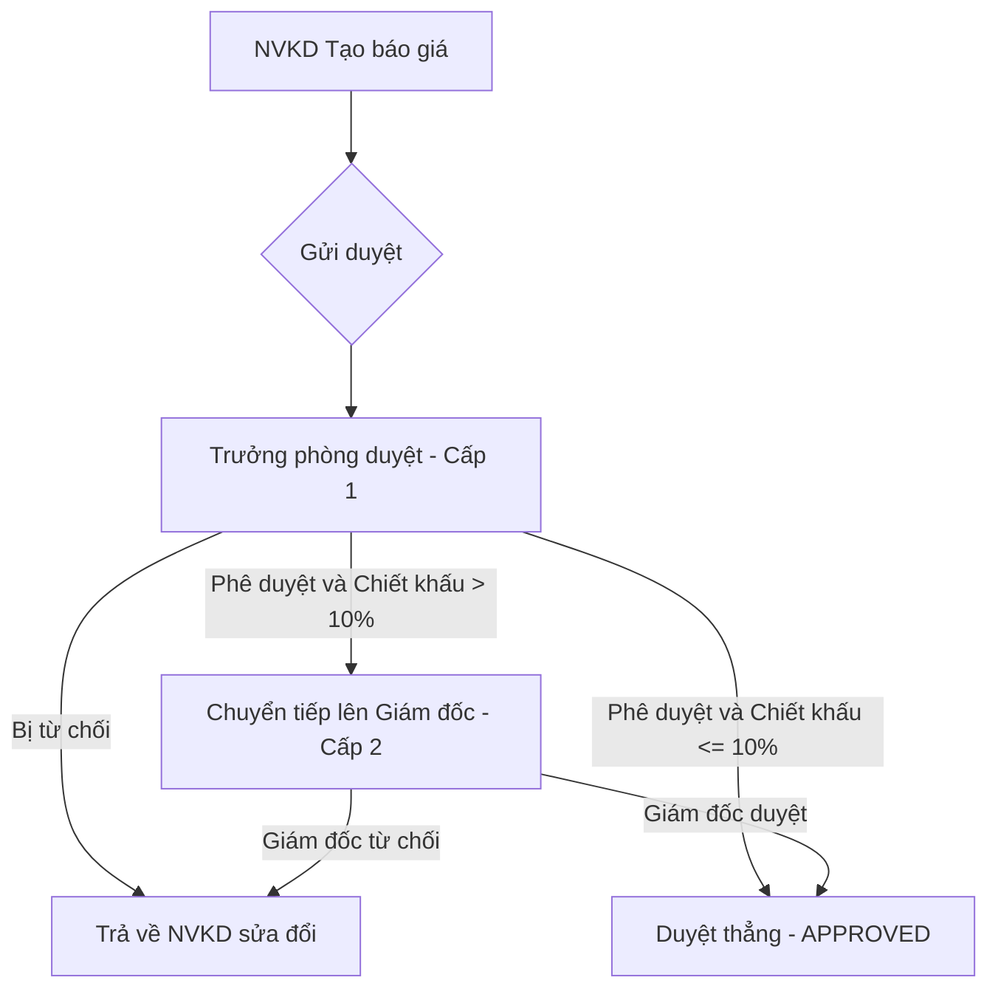

# TÀI LIỆU HƯỚNG DẪN SỬ DỤNG CHI TIẾT
## HỆ THỐNG TÍCH HỢP NEXUS CRM & QUOTEFLOW OS

Chào mừng bạn đến với **NEXUS CRM & QUOTEFLOW OS** — Hệ thống Quản trị Quan hệ Khách hàng (CRM) kết hợp Quản lý Báo giá & Phê duyệt thông minh (CPQ) tích hợp Trợ lý AI và Quản lý Kho hàng (Nhập Xuất Tồn).

Tài liệu này được biên soạn chi tiết giúp người sử dụng nắm vững công năng, ý nghĩa và cách thao tác trên từng màn hình (Form) của hệ thống.

---

## MỤC LỤC
1. [TỔNG QUAN VÀ KHỞI CHẠY](#1-tổng-quan-và-khởi-chạy)
2. [PHÂN HỆ 1: QUẢN TRỊ QUAN HỆ KHÁCH HÀNG (NEXUS CRM)](#2-phân-hệ-1-quản-trị-quan-hệ-khách-hàng-nexus-crm)
   - [2.1. Bảng điều khiển (Dashboard)](#21-bảng-điều-khiển-dashboard)
   - [2.2. Danh sách & Hồ sơ Khách hàng](#22-danh-sách--hồ-sơ-khách-hàng)
   - [2.3. Quy trình Cơ hội bán hàng (Pipeline Kanban)](#23-quy-trình-cơ-hội-bán-hàng-pipeline-kanban)
   - [2.4. Chăm sóc Khách hàng & Lịch hẹn (Follow-up)](#24-chăm-sóc-khách-hàng--lịch-hẹn-follow-up)
   - [2.5. Quét Khách hàng tự động từ Gmail](#25-quét-khách-hàng-tự-động-từ-gmail)
3. [PHÂN HỆ 2: QUẢN LÝ BÁO GIÁ & PHÊ DUYỆT (QUOTEFLOW OS)](#3-phân-hệ-2-quản-lý-báo-giá--phê-duyệt-quoteflow-os)
   - [3.1. Tạo mới Báo giá (Thủ công & Excel mẫu chuẩn)](#31-tạo-mới-báo-giá-thủ-công--excel-mẫu-chuẩn)
   - [3.2. Quản lý Dòng sản phẩm & Chiết khấu chính sách](#32-quản-lý-dòng-sản-phẩm--chiết-khấu-chính-sách)
   - [3.3. Quy trình Phê duyệt 2 Cấp tự động (Timeline & Phản hồi)](#33-quy-trình-phê-duyệt-2-cấp-tự-động-timeline--phản-hồi)
   - [3.4. Quản lý Phiên bản Báo giá (Versioning)](#34-quản-lý-phiên-bản-báo-giá-versioning)
   - [3.5. Xuất bản: In PDF, Excel và Gửi Email Báo giá](#35-xuất-bản-in-pdf-excel-và-gửi-email-báo-giá)
   - [3.6. Cơ chế Tự động hóa Chốt đơn (Won Quote -> Won Deal CRM)](#36-cơ-chế-tự-động-hóa-chốt-đơn-won-quote---won-deal-crm)
4. [PHÂN HỆ 3: QUẢN LÝ HÀNG TỒN KHO (INVENTORY)](#4-phân-hệ-3-quản-lý-hàng-tồn-kho-inventory)
   - [4.1. Báo cáo tồn kho & Cảnh báo tồn kho thấp](#41-báo-cáo-tồn-kho--cảnh-báo-tồn-kho-thấp)
   - [4.2. Nhập/Xuất kho thủ công](#42-nhậpxuất-kho-thủ-công)
   - [4.3. Lịch sử giao dịch kho](#43-lịch-sử-giao-dịch-kho)
   - [4.4. Khai báo Số dư đầu kỳ hàng loạt (Import Excel)](#44-khai-báo-số-dư-đầu-kỳ-hàng-loạt-import-excel)
5. [PHÂN HỆ 4: TRỢ LÝ AI & ĐÀO TẠO SALES THỰC CHIẾN](#5-phân-hệ-4-trợ-lý-ai--đào-tạo-sales-thực-chiến)
   - [5.1. AI Copilot trong CRM (Chấm điểm & Đề xuất)](#51-ai-copilot-trong-crm-chấm-điểm--đề-xuất)
   - [5.2. AI Copilot trong Báo giá (Hỏi đáp Dữ liệu thực tế & API Key)](#52-ai-copilot-trong-báo-giá-hỏi-đáp-dữ-liệu-thực-tế--api-key)
   - [5.3. Phòng luyện Sales thực chiến (AI Sales Coach)](#53-phòng-luyện-sales-thực-chiến-ai-sales-coach)
6. [HỆ THỐNG MẪU IMPORT EXCEL TOÀN DIỆN](#6-hệ-thống-mẫu-import-excel-toàn-diện)
7. [PHÂN QUYỀN VÀ SAO LƯU DỮ LIỆU](#7-phân-quyền-và-sao-lưu-dữ-liệu)

---

## 1. TỔNG QUAN VÀ KHỞI CHẠY

Hệ thống kết hợp sức mạnh của **FastAPI (CRM Backend)** và **Streamlit (Báo giá & Kho)** để tạo ra một ứng dụng đồng nhất. Hai phân hệ tự động chia sẻ thông tin khách hàng, nhân viên và lịch sử chốt sale theo thời gian thực ở cấp cơ sở dữ liệu (SQLite) thông qua cơ chế Đăng nhập một lần (SSO) và sync hook tự động.

### Cách khởi chạy ứng dụng:
1. Truy cập thư mục **`D:\App_Claude_Antigravity\NEXUS-CRM`**.
2. Nhấp đúp chuột vào file **`chay_app.bat`** hoặc chạy **`NEXUS-CRM.exe`**.
3. Hệ thống sẽ tự động khởi tạo môi trường ảo Python `.venv` (nếu chạy lần đầu), cài đặt các thư viện cần thiết và chạy các máy chủ:
   - **CRM Server (FastAPI)**: chạy trên cổng **`8080`** (`http://127.0.0.1:8080`)
   - **Quotation Server (Streamlit)**: chạy trên cổng **`8502`** (`http://127.0.0.1:8502`)
4. Trình duyệt Chrome sẽ tự động mở trang chủ CRM tại: `http://127.0.0.1:8080`.

### Tài khoản đăng nhập mặc định:
*   **Admin CRM**: `admin@nexuscrm.com` / Mật khẩu: `Admin@123`
*   **Tài khoản demo QuoteFlow OS**: `ceo`, `director`, `manager`, `sales1`, `sales2`, `accountant`, `admin` / Mật khẩu chung: `123456`

---

## 2. PHÂN HỆ 1: QUẢN TRỊ QUAN HỆ KHÁCH HÀNG (NEXUS CRM)

### 2.1. Bảng điều khiển (Dashboard)
*   **Ý nghĩa công năng**: Cung cấp bức tranh toàn cảnh về hiệu suất kinh doanh của doanh nghiệp, giúp nhà quản lý đưa ra quyết định chiến lược tức thời.
*   **Các thông số chính**:
    *   *Tổng khách hàng*: Quy mô dữ liệu tệp khách hàng.
    *   *Doanh thu (Won)*: Tổng tiền từ các cơ hội bán hàng đã chốt thành công.
    *   *Tỷ lệ chuyển đổi %*: Hiệu suất chốt hợp đồng của đội ngũ kinh doanh.
*   **Biểu đồ xu hướng**:
    *   *Nguồn khách hàng*: Phân tích nguồn gốc khách hàng (Ads, Zalo, Website...) để tối ưu ngân sách marketing.
    *   *Deals theo giai đoạn*: Nhận diện các điểm nghẽn trong phễu bán hàng.
    *   *KPI xếp hạng Sale*: Đo lường và vinh danh nhân viên chốt đơn xuất sắc nhất.

### 2.2. Danh sách & Hồ sơ Khách hàng
*   **Ý nghĩa công năng**: Lưu trữ và quản lý tập trung toàn bộ thông tin chi tiết về khách hàng.
*   **Các nút chức năng**:
    *   *Thêm mới khách hàng*: Nhập Tên, SĐT, Email, Nguồn, Mã số thuế, Nhóm Khách hàng (`VIP`, `Đại lý`, `Bán lẻ`) và phân công nhân viên chăm sóc.
    *   *Bộ lọc thông minh*: Lọc danh sách khách hàng theo nguồn, nhóm hàng hoặc nhân viên quản lý.
    *   *Import/Export*: Hỗ trợ tải lên file Excel để nạp hàng ngàn khách hàng nhanh chóng.

### 2.3. Quy trình Cơ hội bán hàng (Pipeline Kanban)
*   **Ý nghĩa công năng**: Quản lý các cơ hội bán hàng đang diễn ra theo mô hình thẻ Kanban trực quan.
*   **Các bước trong phễu bán hàng (Stages)**:
    1.  `Lead`: Khách hàng mới liên hệ, chưa đánh giá sâu.
    2.  `Contacted`: Sale đã liên hệ, tìm hiểu nhu cầu sơ bộ.
    3.  `Proposal`: Đã gửi báo giá hoặc phương án giải pháp.
    4.  `Negotiation`: Đang thương lượng về giá, chiết khấu và điều khoản.
    5.  `Won`: Chốt hợp đồng thành công (Hệ thống tự động đồng bộ khi Báo giá được đánh dấu Win).
    6.  `Lost`: Thương vụ thất bại (ghi rõ lý do để cải thiện).
*   **Cách thao tác**: Kéo và thả các thẻ từ cột này sang cột khác để cập nhật trạng thái cơ hội bán hàng.

### 2.4. Chăm sóc Khách hàng & Lịch hẹn (Follow-up)
*   **Ý nghĩa công năng**: Ghi lại lịch sử tương tác và lên lịch chăm sóc tiếp theo, đảm bảo không bỏ sót khách hàng.
*   **Thao tác trong màn hình Chi tiết Khách hàng**:
    *   *Dòng thời gian (Timeline)*: Xem lại toàn bộ nhật ký tương tác (Ví dụ: *"Ngày 10/07: Gọi điện khách chê giá cao, đề xuất giảm 5%"*).
    *   *Lên lịch hẹn (Follow-up)*: Đặt lịch hẹn ngày giờ cụ thể để hệ thống gửi cảnh báo nhắc nhở qua email/thông báo khi đến hạn.
    *   *Đính kèm tài liệu*: Đính kèm các file hợp đồng nháp, hình ảnh mặt bằng trực tiếp vào hồ sơ khách hàng.

### 2.5. Quét Khách hàng tự động từ Gmail
*   **Ý nghĩa công năng**: Tự động hóa khâu nhập liệu đầu vào bằng cách tự động đọc email từ form đăng ký của website đổ về Gmail.
*   **Cách vận hành**: Hệ thống tự quét các thư đến có cấu trúc đăng ký, bóc tách SĐT, Tên, Nội dung yêu cầu và tự động tạo một khách hàng mới ở cột `Lead` trên CRM kèm gắn nhãn nguồn `Email`.

---

## 3. PHÂN HỆ 2: QUẢN LÝ BÁO GIÁ & PHÊ DUYỆT (QUOTEFLOW OS)

Khi nhấp vào mục **Báo giá** ở menu CRM bên trái, hệ thống tự động đăng nhập SSO thông qua token bảo mật và hiển thị phân hệ CPQ nâng cao.

### 3.1. Tạo mới Báo giá (Thủ công & Excel mẫu chuẩn)
*   **Ý nghĩa công năng**: Khởi tạo báo giá gửi khách hàng.
*   **Phương thức thực hiện**:
    *   *Nhập liệu thủ công*: Chọn khách hàng, nhập các điều kiện giao hàng, thanh toán, hạn hiệu lực và chi phí phụ trội.
    *   *Import từ Excel mẫu chuẩn (Được khuyến nghị)*:
        1.  Chọn khách hàng và nhân viên kinh doanh phụ trách.
        2.  Tải file mẫu chuẩn Excel về máy (`template_tao_bao_gia.xlsx`). File này đã điền sẵn toàn bộ danh mục sản phẩm và giá bán niêm yết hiện tại của công ty.
        3.  Mở file Excel, chỉ cần nhập cột **Số lượng (qty)** và **Chiết khấu % (discount_pct)** cho những mặt hàng cần báo giá, rồi lưu lại.
        4.  Tải file Excel đã điền lên hệ thống $\rightarrow$ Bấm **Khởi tạo báo giá từ Excel mẫu chuẩn**. Hệ thống tự động tạo mã báo giá và điền đầy đủ hàng chục dòng hàng trong 1 giây.

### 3.2. Quản lý Dòng sản phẩm & Chiết khấu chính sách
*   **Ý nghĩa công năng**: Tùy chỉnh chi tiết cấu thành giá cho từng sản phẩm trong báo giá.
*   **Các tham số cấu hình**:
    *   *Số lượng*: Lượng sản phẩm khách hàng đặt.
    *   *Đơn giá*: Mặc định lấy từ bảng giá chuẩn nhưng có thể điều chỉnh linh hoạt.
    *   *Chiết khấu %*: Nhập phần trăm giảm giá. Hệ thống sẽ kiểm tra nếu vượt quá **Mức chiết khấu tối đa** được cấu hình trong danh mục sản phẩm, hệ thống sẽ từ chối lưu để bảo toàn biên lợi nhuận.
    *   *Thuế VAT%*: Áp dụng mức thuế suất phù hợp (0%, 5%, 8%, 10%).

### 3.3. Quy trình Phê duyệt 2 Cấp tự động (Timeline & Phản hồi)
Để ngăn ngừa tình trạng nhân viên bán hàng tự ý giảm giá sâu gây thiệt hại cho công ty, hệ thống áp dụng luồng phê duyệt 2 cấp tự động:

*   **Timeline phê duyệt trực quan**: 
    Tại màn hình chi tiết báo giá và thẻ duyệt, hệ thống hiển thị dòng tiến trình rõ ràng:
    *   *Cấp 1 (Trưởng phòng)*: Trạng thái, Tên người duyệt, Thời gian phê duyệt, Ý kiến nhận xét.
    *   *Cấp 2 (Giám đốc/CEO)*: Trạng thái tương tự (chỉ kích hoạt nếu báo giá có chiết khấu cao vượt ngưỡng 10%).
*   **Ý kiến phản hồi**: Người duyệt bắt buộc phải nhập nội dung tại ô `Ý kiến phê duyệt / Lý do từ chối` trước khi bấm duyệt để làm cơ sở phản hồi cho nhân viên kinh doanh sửa đổi báo giá.

### 3.4. Quản lý Phiên bản Báo giá (Versioning)
*   **Ý nghĩa công năng**: Theo dõi lịch sử đàm phán giá với khách hàng.
*   **Cách thức**: Mỗi lần báo giá bị từ chối hoặc cần điều chỉnh giá bán/số lượng theo yêu cầu của khách, hệ thống cho phép tạo một **Snapshot Phiên bản** (`v1`, `v2`, `v3`...). Người dùng có thể đối chiếu các phiên bản hoặc khôi phục lại phiên bản cũ bất cứ lúc nào.

### 3.5. Xuất bản: In PDF, Excel và Gửi Email Báo giá
*   **Ý nghĩa công năng**: Chuyển giao báo giá đến tay khách hàng một cách chuyên nghiệp nhất.
*   **Các hình thức xuất bản**:
    *   *In PDF*: Tạo file PDF báo giá tiếng Việt sắc nét, có logo, thông tin thanh toán, khung chữ ký đóng dấu chuẩn mực.
    *   *Xuất Excel*: Tạo bảng tính chi tiết dòng hàng gửi khách đối chiếu.
    *   *Gửi Email trực tiếp*: Hệ thống tự động đính kèm file PDF báo giá vào email và gửi trực tiếp tới hòm thư của khách hàng, đồng thời chuyển trạng thái báo giá sang `Đã gửi khách`.

### 3.6. Cơ chế Tự động hóa Chốt đơn (Won Quote -> Won Deal CRM)
*   **Ý nghĩa công năng**: Tự động hóa quy trình nghiệp vụ giữa Báo giá và CRM, loại bỏ việc thao tác thủ công lặp lại.
*   **Cách thức vận hành**:
    *   Khi khách hàng đồng ý mua hàng, nhân viên bấm nút **Chốt đơn (Win)** trên giao diện Báo giá.
    *   Hệ thống sẽ tự động tìm kiếm Deal tương ứng của khách hàng này bên phân hệ CRM và chuyển trạng thái Deal sang **Won** (Chốt thành công).
    *   Đồng thời, trạng thái của Khách hàng bên CRM sẽ tự động được cập nhật thành **Đã chốt**.
    *   Giá trị thực tế của Deal sẽ được đồng bộ chính xác theo tổng số tiền sau thuế của báo giá đã chốt.

---

## 4. PHÂN HỆ 3: QUẢN LÝ HÀNG TỒN KHO (INVENTORY)

Quản lý Nhập Xuất Tồn kho nằm trong tab **Tồn kho** giúp kiểm soát số lượng hàng hóa thực tế và dự báo nhu cầu nhập hàng.

### 4.1. Báo cáo tồn kho & Cảnh báo tồn kho thấp
*   **Ý nghĩa công năng**: Giúp thủ kho và nhân viên bán hàng nắm rõ lượng hàng khả dụng trong kho thời gian thực.
*   **Giao diện hiển thị**:
    *   Bảng báo cáo tồn kho chi tiết gồm mã SKU, Tên sản phẩm, Quy cách, Số lượng tồn, Giá bán và Biên lợi nhuận dự kiến.
    *   **Cảnh báo tồn kho thấp**: Hệ thống tự động bôi đỏ trạng thái và hiển thị cảnh báo nổi trên màn hình đối với các sản phẩm có lượng tồn dưới ngưỡng an toàn (ví dụ: < 15 sản phẩm) để kế hoạch nhập hàng kịp thời.

### 4.2. Nhập/Xuất kho thủ công
*   **Ý nghĩa công năng**: Thực hiện điều chỉnh kho trong các trường hợp phi thương mại (Nhập mẫu, xuất kiểm mẫu, xuất hủy hàng hỏng, cân bằng kho khi kiểm kê).
*   **Thao tác**: Chọn sản phẩm, chọn loại giao dịch (`Nhập kho` hoặc `Xuất kho`), nhập số lượng điều chỉnh và ghi rõ lý do thực hiện.

### 4.3. Lịch sử giao dịch kho
*   **Ý nghĩa công năng**: Lưu trữ nhật ký vết của mọi giao dịch biến động kho.
*   **Chi tiết dòng tiền/dòng hàng**: Hiển thị rõ ràng Ngày giao dịch, loại giao dịch (Nhập, Xuất, Khai báo đầu kỳ, Bán hàng), số lượng biến động, số dư sau giao dịch, mã chứng từ tham chiếu và tên người thực hiện.

### 4.4. Khai báo Số dư đầu kỳ hàng loạt (Import Excel)
*   **Ý nghĩa công năng**: Thiết lập số dư ban đầu cho các mặt hàng khi bắt đầu đưa phần mềm vào vận hành.
*   **Cách thực hiện**:
    *   *Cách 1 (Thủ công)*: Nhập số lượng đầu kỳ trực tiếp cho từng sản phẩm tại tab **Khai báo số dư đầu kỳ**.
    *   *Cách 2 (Excel hàng loạt - Khuyến nghị)*:
        1.  Nhấp nút **Tải file mẫu Số dư đầu kỳ (.xlsx)**. File mẫu này đã có sẵn toàn bộ danh sách sản phẩm hiện tại của hệ thống.
        2.  Điền số lượng tồn kho đầu kỳ của từng sản phẩm vào cột `stock_qty` và điền ghi chú (nếu có) vào cột `note`.
        3.  Tải file Excel đã điền lên hệ thống và ấn **Cập nhật số dư đầu kỳ hàng loạt**.

> [!TIP]
> Bạn có thể thực hiện tính năng này trực tiếp tại tab 3 của trang **Import Excel** chính để thuận tiện gom tất cả thao tác nạp dữ liệu về một nơi.

---

## 5. PHÂN HỆ 4: TRỢ LÝ AI & ĐÀO TẠO SALES THỰC CHIẾN

### 5.1. AI Copilot trong CRM (Chấm điểm & Đề xuất)
*   **Ý nghĩa công năng**: Đóng vai trò là trợ lý đắc lực hỗ trợ nhân viên Sale phân tích hành vi khách hàng để gia tăng tỷ lệ chốt đơn.
*   **Các tính năng nổi bật ở trang chi tiết khách hàng**:
    *   *AI Summary*: Đọc hiểu toàn bộ lịch sử tương tác và viết một bản tóm tắt ngắn gọn trong 3 dòng.
    *   *AI Suggest*: Đề xuất kịch bản, câu thoại tư vấn tiếp theo dựa trên diễn biến trước đó của khách hàng.
    *   *AI Score*: Đánh giá mức độ tiềm năng (Thang điểm 100). Khách hàng có điểm càng cao thì sale nên ưu tiên chăm sóc trước.
    *   *AI Auto-tag*: Tự động gắn các thẻ hành vi như: `Nhạy cảm giá`, `Chốt nhanh`, `Cần tư vấn kỹ`.

### 5.2. AI Copilot trong Báo giá (Hỏi đáp Dữ liệu thực tế & API Key)
*   **Ý nghĩa công năng**: Trợ lý phân tích kinh doanh (Business Intelligence) thông minh dành cho nhà quản lý.
*   **Các tính năng**:
    *   *Cấu hình khóa API linh hoạt*: Cho phép nạp và lưu trữ API Key của Claude (Anthropic) và Gemini (Google) trực tiếp trên giao diện. Trạng thái kết nối hiển thị trực quan dưới dạng huy hiệu màu sắc.
    *   *Hỏi đáp dữ liệu thực tế*: AI tự động đọc các bảng biểu doanh số, danh sách sản phẩm bán chạy, thứ hạng sale của hệ thống làm ngữ cảnh để trả lời các câu hỏi phức tạp của bạn.
        *   *Ví dụ câu hỏi*: *"Sản phẩm nào đang mang lại doanh thu cao nhất và nhân viên nào chốt đơn tốt nhất tháng này? Hãy gợi ý chiến lược thúc đẩy sản phẩm bán chậm."*

### 5.3. Phòng luyện Sales thực chiến (AI Sales Coach)
*   **Ý nghĩa công năng**: Đào tạo và nâng cao kỹ năng đàm phán cho nhân viên kinh doanh thông qua các tình huống giả lập.
*   **Quy trình luyện tập**:
    1.  *Thiết lập kịch bản*: Chọn kịch bản đàm phán (`Xử lý khi khách chê giá cao`, `Giải thích thông số kỹ thuật`, `Thương thảo hợp đồng`).
    2.  *Chọn cá tính khách hàng ảo*: `Tiết kiệm` (luôn đòi giảm giá), `Khó tính` (bắt bẻ từng câu chữ), `Nghiêm túc` (tập trung vào chất lượng).
    3.  *Thử thách hội thoại*: Nhân viên tiến hành chat trực tiếp với khách hàng ảo để xử lý các chất vấn, phản đối của khách hàng.
    4.  *AI Coach nhận xét & Chấm điểm*: Khi kết thúc thử thách, AI Coach sẽ chấm điểm tổng quan và phân tích chi tiết:
        *   Chỉ ra các câu nói chưa thuyết phục của nhân viên bán hàng.
        *   Đưa ra câu thoại gợi ý thay thế tối ưu hơn để thuyết phục khách hàng ảo.
        *   Đánh giá năng lực theo 4 chỉ số: *Độ thuyết phục, Khả năng xử lý từ chối, Độ chuyên nghiệp, và Khả năng chốt deal*.

---

## 6. HỆ THỐNG MẪU IMPORT EXCEL TOÀN DIỆN

Trang **Import Excel** trên thanh menu bên trái là trung tâm nạp dữ liệu hàng loạt của hệ thống, bao gồm 3 tab chức năng chính:

1.  **Tab 1: Import Sản phẩm**
    *   *Công năng*: Đẩy danh mục hàng hóa lên hệ thống. Tự động cập nhật nếu mã hàng (SKU) đã tồn tại hoặc thêm mới nếu chưa có.
2.  **Tab 2: Import Khách hàng**
    *   *Công năng*: Đẩy danh sách khách hàng từ hệ thống cũ sang. Tự động cập nhật thông tin nếu trùng mã khách hàng (`code`).
3.  **Tab 3: Import Số dư đầu kỳ (Tồn kho)**
    *   *Công năng*: Nạp số lượng hàng tồn kho thực tế lúc bắt đầu sử dụng phần mềm.

---

## 7. PHÂN QUYỀN VÀ SAO LƯU DỮ LIỆU

### Phân quyền người dùng (RBAC):
*   **Admin (Quản trị viên)**: Toàn quyền cấu hình hệ thống, quản lý tài khoản nhân viên, xem toàn bộ nhật ký hệ thống (`Audit Logs`), cấu hình SMTP và thực hiện sao lưu dữ liệu.
*   **Manager/Director (Quản lý/Giám đốc)**: Xem báo cáo tổng hợp, phê duyệt các báo giá có chiết khấu cao (> 10%), quản lý danh mục sản phẩm.
*   **Sale (Nhân viên kinh doanh)**: Chỉ xem và chăm sóc khách hàng được phân công phụ trách; tạo báo giá và gửi duyệt báo giá cá nhân.

### Sao lưu & Phục hồi (Tab Cài đặt):
*   **Tạo bản sao lưu**: Admin có thể bấm nút **Sao lưu dữ liệu** để tạo một bản sao dự phòng tức thời của cơ sở dữ liệu.
*   **Tải bản sao lưu**: Các bản sao lưu được lưu trữ theo thời gian thực và cho phép Admin tải về máy tính cá nhân để lưu trữ ngoại tuyến phòng ngừa sự cố phần cứng.
