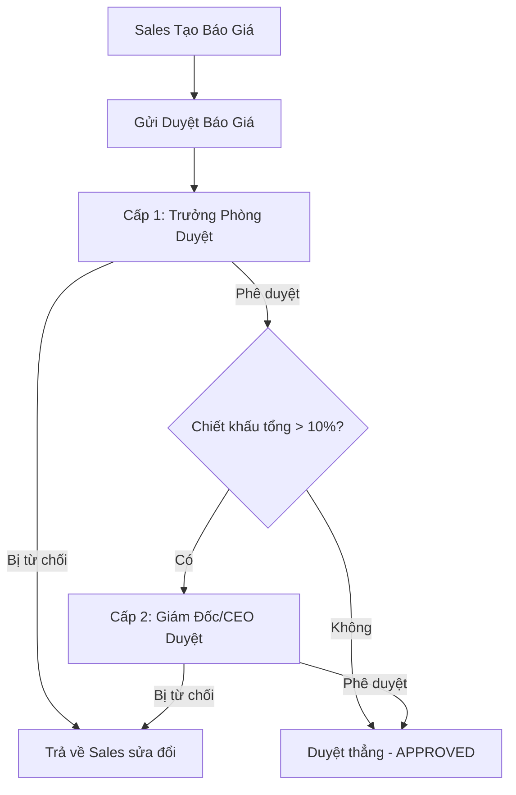

# 📊 TÀI LIỆU HƯỚNG DẪN SỬ DỤNG CHI TIẾT
## HỆ THỐNG TÍCH HỢP NEXUS CRM & QUOTEFLOW OS (PHIÊN BẢN 1.0)

> **Mục tiêu hệ thống**: Chuẩn hóa toàn bộ quy trình bán hàng, từ quản lý khách hàng, báo giá chuyên nghiệp (CPQ), phê duyệt giá chiết khấu tự động, đến quản lý kho hàng và đào tạo đội ngũ kinh doanh bằng Trợ lý AI.
> **Khách hàng ➔ Cơ hội (Deal) ➔ Báo giá (Quote) ➔ Phê duyệt (Approval) ➔ Gửi khách ➔ Đàm phán ➔ Chốt đơn (Won) ➔ Xuất kho (Inventory) ➔ Doanh thu**.

---

## 📖 MỤC LỤC
1. [TỔNG QUAN HỆ THỐNG & KIẾN TRÚC](#1-tổng-quan-hệ-thống--kiến-trúc)
2. [HƯỚNG DẪN KHỞI CHẠY (PHIÊN BẢN PYTHON LOCAL)](#2-hướng-dẫn-khởi-chạy-phiên-bản-python-local)
3. [HƯỚNG DẪN TRIỂN KHAI CLOUD (GOOGLE APPS SCRIPT & GOOGLE SHEETS)](#3-hướng-dẫn-triển-khai-cloud-google-apps-script--google-sheets)
4. [CHI TIẾT CHỨC NĂNG PHÂN HỆ NEXUS CRM](#4-chi-tiết-chức-năng-phân-hệ-nexus-crm)
5. [CHI TIẾT CHỨC NĂNG PHÂN HỆ QUOTEFLOW OS (CPQ & WORKFLOW)](#5-chi-tiết-chức-năng-phân-hệ-quoteflow-os-cpq--workflow)
6. [CHI TIẾT PHÂN HỆ QUẢN LÝ KHO HÀNG (INVENTORY)](#6-chi-tiết-phân-hệ-quản-lý-kho-hàng-inventory)
7. [TRỢ LÝ TRÍ TUỆ NHÂN TẠO (AI COPILOT & SALES COACH)](#7-trợ-lý-trí-tuệ-nhân-tạo-ai-copilot--sales-coach)
8. [PHÂN QUYỀN (RBAC), BẢO MẬT & SAO LƯU DỮ LIỆU](#8-phân-quyền-rbac-bảo-mật--sao-lưu-dữ-liệu)
9. [CÁC LỖI THƯỜNG GẶP & CÁCH XỬ LÝ (FAQ)](#9-các-lỗi-thường-gặp--cách-xử-lý-faq)

---

## 1. TỔNG QUAN HỆ THỐNG & KIẾN TRÚC

NEXUS CRM & QUOTEFLOW OS là một hệ sinh thái quản lý bán hàng đồng nhất, hỗ trợ doanh nghiệp SME vận hành theo hai mô hình linh hoạt:

1. **Kiến trúc Offline/Local (FastAPI + Streamlit + SQLite)**:
   - **Backend CRM**: FastAPI phục vụ cơ chế API nghiệp vụ và Web App SPA tĩnh.
   - **Frontend CRM**: Một ứng dụng đơn trang (SPA) viết bằng HTML5, Bootstrap 5, Javascript thuần, kết hợp các thư viện mạnh mẽ như Chart.js, SweetAlert2, DataTables, SortableJS, và SheetJS.
   - **Phân hệ CPQ & Kho (QuoteFlow OS)**: Chạy trên nền tảng Streamlit, kết nối trực tiếp với SQLite để tạo báo giá, duyệt giá và quản lý kho.
   - **Đồng bộ hóa**: Tự động chia sẻ và đồng bộ hóa thông tin khách hàng, người dùng từ CRM sang Báo giá thông qua các sync hook ở cấp cơ sở dữ liệu (`sync_to_quoteflow_db`).

2. **Kiến trúc Cloud (Google Apps Script + Google Sheets)**:
   - Toàn bộ backend chạy trên Google Apps Script (GAS).
   - Google Sheets đóng vai trò cơ sở dữ liệu lưu trữ trực tiếp (Database).
   - Tận dụng các dịch vụ sẵn có của Google Workspace (Gmail, Calendar, Drive).

---

## 2. HƯỚNG DẪN KHỞI CHẠY (PHIÊN BẢN PYTHON LOCAL)

Phiên bản này phù hợp để chạy cục bộ trên máy tính văn phòng hoặc triển khai trên VPS riêng của doanh nghiệp.

### 2.1. Cách khởi động ứng dụng
1. Giải nén thư mục dự án và truy cập thư mục: `D:\App_Claude_Antigravity\NEXUS-CRM`.
2. Nhấp đúp chuột vào file **`chay_app.bat`** (hoặc chạy file thực thi đóng gói sẵn **`NEXUS-CRM.exe`**).
3. Tập lệnh sẽ tự động:
   - Kiểm tra và tạo môi trường ảo Python `.venv` nếu chưa có.
   - Cài đặt các thư viện yêu cầu trong `requirements.txt`.
   - Khởi chạy song song 2 dịch vụ:
     - **CRM Web App (FastAPI)**: trên cổng **`8080`** (`http://127.0.0.1:8080`).
     - **QuoteFlow OS (Streamlit)**: trên cổng **`8502`** (`http://127.0.0.1:8502`).
   - Tự động mở Google Chrome truy cập trang chủ CRM tại địa chỉ: `http://127.0.0.1:8080` sau 4 giây.

### 2.2. Danh sách tài khoản đăng nhập mẫu
Hệ thống sử dụng cơ sở dữ liệu SQLite tự động sinh dữ liệu mẫu trong lần chạy đầu tiên. Dưới đây là các tài khoản mặc định phục vụ chạy thử nghiệm:

| Tên tài khoản (Email/Username) | Mật khẩu | Vai trò hệ thống | Phạm vi quyền hạn |
| :--- | :--- | :--- | :--- |
| **admin@nexuscrm.com** / **admin** | `Admin@123` hoặc `123456` | **Admin** (Quản trị viên) | Toàn quyền hệ thống, xem nhật ký, cấu hình SMTP/AI, sao lưu dữ liệu. |
| **ceo** | `123456` | **CEO** (Giám đốc điều hành) | Xem báo cáo tổng, phê duyệt báo giá cấp cao (Cấp 2), quản lý sản phẩm. |
| **director** | `123456` | **Giám đốc Kinh doanh** | Quản lý đội ngũ, xem KPI, duyệt báo giá Cấp 2, quản lý sản phẩm. |
| **manager** | `123456` | **Trưởng phòng Kinh doanh** | Xem dữ liệu nhóm, duyệt báo giá Cấp 1 (chiết khấu <= 10%). |
| **sales1** / **sales2** | `123456` | **Nhân viên Kinh doanh** | Chỉ xem và chăm sóc khách hàng được gán, tạo báo giá, gửi duyệt. |
| **accountant** | `123456` | **Kế toán** | Theo dõi công nợ, xuất file xuất kho, xem giá trị báo giá đã chốt. |

> [!WARNING]
> Khi đưa hệ thống vào vận hành thực tế, Quản trị viên bắt buộc phải đổi mật khẩu của tài khoản `admin@nexuscrm.com` và các tài khoản demo để bảo mật thông tin.

### 2.3. Cấu hình tệp môi trường `.env` cho Báo giá (QuoteFlow OS)
Tệp cấu hình nằm tại đường dẫn `d:\App_Claude_Antigravity\NEXUS-CRM\Bao-gia\.env`. Sao chép từ `.env.example` và thiết lập các thông số:
*   `JWT_SECRET`: Chuỗi khóa bảo mật dùng để ký token JWT (nên chọn chuỗi ngẫu nhiên dài).
*   `SMTP_HOST`, `SMTP_PORT`, `SMTP_USER`, `SMTP_PASSWORD`: Cấu hình máy chủ gửi email tự động (ví dụ: host `smtp.gmail.com`, port `587`, sử dụng mật khẩu ứng dụng Gmail). Nếu để trống, hệ thống sẽ tự chuyển sang chế độ **MÔ PHỎNG (Simulated)** để ghi log mà không crash ứng dụng.

---

## 3. HƯỚNG DẪN TRIỂN KHAI CLOUD (GOOGLE APPS SCRIPT & GOOGLE SHEETS)

Phiên bản này vận hành trực tiếp trong môi trường đám mây của Google mà không cần thuê máy chủ.

### 3.1. Các bước thiết lập ban đầu
1. **Tạo Database**: Tạo một bảng tính Google Sheets mới trên Google Drive của bạn (ví dụ đặt tên: `NEXUS CRM DATABASE`).
2. **Mở trình chỉnh sửa mã**: Trên thanh công cụ Google Sheets, chọn **Tiện ích mở rộng (Extensions)** ➔ **Apps Script**.
3. **Sao chép mã nguồn**: Xóa file `Code.gs` trống mặc định. Tạo mới 14 file có đuôi `.gs` (Backend) và 4 file có đuôi `.html` (Frontend) đúng với cấu trúc mã nguồn.
   > [!IMPORTANT]
   > Tên các file HTML phải viết hoa chính xác chữ cái đầu tiên (ví dụ: `01_Index.html`, `02_Style.html`, `03_Components.html`, `04_Script.html`).
4. **Khởi tạo dữ liệu**: Chọn hàm `setup` trên thanh công cụ Apps Script và bấm **Chạy (Run)**. Đồng ý cấp toàn bộ quyền truy cập (Review permissions ➔ Allow). Hàm này sẽ tự động tạo 12 sheet dữ liệu cần thiết kèm tài khoản Admin mặc định (`admin@nexuscrm.com` / `Admin@123`).

### 3.2. Cấu hình Khóa Bảo mật & API Key
Để các chức năng AI và cổng Webhook hoạt động, thực hiện:
1. Mở file `Code.gs` (hoặc file cấu hình tương ứng trong Apps Script).
2. Tìm hàm `setupSecrets()`. Điền các khóa API thực tế:
   - `CLAUDE_API_KEY`: Khóa API từ Anthropic.
   - `OPENAI_API_KEY`: Khóa API từ OpenAI.
   - `WEBHOOK_SECRET_KEY`: Khóa bảo vệ cổng webhook do bạn tự đặt (ví dụ: `nexus_secret_abc123`).
3. Chạy hàm `setupSecrets()` để lưu các khóa này vào `PropertiesService`.
4. **Xóa hoàn toàn** các chuỗi API Key vừa điền trong code và lưu file lại nhằm tránh lộ mã khóa khi chia sẻ code.

### 3.3. Triển khai Web App (Deploy)
Bạn cần thực hiện triển khai dự án thành một ứng dụng web:
1. Ở góc phải màn hình Apps Script, chọn **Deploy** ➔ **New deployment**.
2. Bấm nút bánh răng cài đặt, chọn **Web app**.
3. Thiết lập thông số:
   - *Execute as*: **Me (Tài khoản Google của bạn)**.
   - *Who has access*: **Anyone** (để webhook bên ngoài gọi vào được).
4. Nhấn **Deploy** và sao chép **Web app URL**. Đường link này dùng để truy cập giao diện CRM.
5. **Cổng Webhook**: Webhook sẽ nhận dữ liệu từ các bên thứ ba (như Zalo OA, Facebook Lead, Website Form) theo định dạng:
   `[Web_app_URL]?channel=[Kênh_Đồng_Bộ]&key=[WEBHOOK_SECRET_KEY]`
   *Ví dụ đồng bộ Zalo*: `https://script.google.com/.../exec?channel=zalo&key=nexus_secret_abc123`

### 3.4. Bật Trigger tự động chạy ngầm
1. **Trigger nhắc việc**: Chạy hàm `setupTriggers`. Hệ thống tự đăng ký sự kiện dọn dẹp session hết hạn lúc 1h sáng và gửi email nhắc lịch follow-up cho Sales vào lúc 8h sáng hàng ngày.
2. **Trigger quét Gmail**: Chạy hàm `enableGmailScanTrigger`. Cứ mỗi 15 phút, hệ thống tự bóc tách thư đến có nhãn `CRM-Lead` để tự động thêm khách hàng mới.

---

## 4. CHI TIẾT CHỨC NĂNG PHÂN HỆ NEXUS CRM

### 4.1. Bảng điều khiển (Dashboard)
*   **KPIs thẻ số**: Hiển thị tổng số khách hàng hiện có, số khách hàng mới phát sinh trong ngày, số khách hàng đang chăm sóc, doanh thu thực tế từ cơ hội đã chốt (`Won`) và tỷ lệ chuyển đổi chốt deal thành công.
*   **Biểu đồ động**:
    - *Biểu đồ đường (Line Chart)*: Xuương doanh thu thực tế trong vòng 6 tháng gần nhất.
    - *Biểu đồ tròn (Pie Chart)*: Cơ cấu nguồn khách hàng (Facebook, Zalo, Website, Ads, Referral...).
    - *Biểu đồ cột (Bar Chart)*: Số lượng cơ hội (Deals) phân bổ theo từng giai đoạn phễu bán hàng.
*   **KPI Xếp hạng Sale**: Bảng vinh danh nhân viên kinh doanh có doanh thu thực tế cao nhất hệ thống.

### 4.2. Quản lý Khách hàng
*   **Thêm mới khách hàng**: Nhập các thông tin liên hệ, Nguồn, Phân loại nhóm hàng (`VIP`, `Đại lý`, `Bán lẻ`), và gán cho Nhân viên Sale phụ trách.
*   **Tìm kiếm & Bộ lọc**: Tìm kiếm thời gian thực theo Tên, SĐT, Email hoặc lọc theo nguồn khách, nhân viên phụ trách và trạng thái chăm sóc.
*   **Import/Export Excel**: Hỗ trợ nạp hàng ngàn khách hàng từ file excel hoặc xuất file báo cáo khách hàng ra máy tính.

### 4.3. Quy trình Cơ hội bán hàng (Pipeline Kanban)
Giao diện Kanban trực quan hóa phễu bán hàng qua 6 giai đoạn:
1.  `Lead` (Khách hàng tiềm năng thô).
2.  `Contacted` (Đã liên hệ, xác định nhu cầu sơ bộ).
3.  `Proposal` (Đã gửi giải pháp/Báo giá).
4.  `Negotiation` (Đang thương thảo điều khoản/giá).
5.  `Won` (Chốt deal thành công - Hệ thống tự chuyển trạng thái khi Báo giá tương ứng được bấm Win).
6.  `Lost` (Thất bại).
*Thao tác*: Người dùng chỉ cần kéo và thả thẻ khách hàng giữa các cột để cập nhật trạng thái cơ hội bán hàng.

### 4.4. Chăm sóc Khách hàng & Lịch hẹn (Follow-up)
*   **Dòng thời gian tương tác (Timeline)**: Hiển thị toàn bộ nhật ký gọi điện, làm việc, ghi chú trao đổi với khách hàng theo dạng thời gian giảm dần (tương tự timeline mạng xã hội).
*   **Đặt lịch follow-up**: Thiết lập Ngày giờ hẹn chăm sóc tiếp theo. Hệ thống tự động tạo sự kiện đồng bộ lên Google Calendar của Sale và gửi email cảnh báo khi đến hạn.
*   **Đính kèm tài liệu**: Upload và lưu trữ các file báo giá riêng, ảnh hiện trạng, hợp đồng quét trực tiếp vào hồ sơ khách hàng.

---

## 5. CHI TIẾT CHỨC NĂNG PHÂN HỆ QUOTEFLOW OS (CPQ & WORKFLOW)

Khi nhấp vào mục **Báo giá** ở thanh menu CRM, hệ thống tự động đăng nhập SSO và chuyển hướng người dùng sang phân hệ CPQ (Configure Price Quote) nâng cao chạy trên cổng `8502`.

### 5.1. Tạo mới Báo giá
Hệ thống cung cấp hai phương thức tạo báo giá:
1.  **Nhập liệu thủ công**: Chọn khách hàng, nhân viên phụ trách, nhập điều khoản thanh toán, giao hàng, thuế suất VAT, chiết khấu và thêm từng sản phẩm.
2.  **Khởi tạo từ Excel mẫu chuẩn (Khuyến nghị)**:
    - Bước 1: Chọn khách hàng và nhân viên phụ trách.
    - Bước 2: Tải xuống file Excel danh mục sản phẩm chuẩn hiện tại (`template_tao_bao_gia.xlsx`).
    - Bước 3: Điền cột Số lượng (`qty`) và Chiết khấu % (`discount_pct`) cho các sản phẩm cần báo giá, lưu lại file.
    - Bước 4: Upload file lên hệ thống và bấm **Khởi tạo báo giá từ Excel mẫu chuẩn**. Hệ thống tự động tạo mã báo giá có cấu trúc `BG-2026-XXXXXX` và điền chi tiết hàng chục dòng sản phẩm trong 1 giây.

### 5.2. Quản lý chính sách giá & Chiết khấu tối đa
*   Hệ thống tự động tra cứu bảng giá bán lẻ niêm yết trong cơ sở dữ liệu khi chọn sản phẩm.
*   **Chặn vượt chiết khấu**: Mỗi sản phẩm có quy định **Mức chiết khấu tối đa** (ví dụ: tối đa 15%). Nếu Sales nhập chiết khấu vượt mức này, hệ thống sẽ báo lỗi và từ chối lưu báo giá để bảo toàn lợi nhuận tối thiểu cho công ty.

### 5.3. Quy trình phê duyệt tự động 2 Cấp
Để đảm bảo kiểm soát dòng tiền và biên lợi nhuận, hệ thống áp dụng workflow phê duyệt dựa trên mức chiết khấu của báo giá:

*   **Ý kiến phản hồi**: Người duyệt bắt buộc phải nhập lý do từ chối hoặc ý kiến chỉ đạo tại ô nhận xét trước khi bấm nút Phê duyệt/Từ chối.
*   **Timeline phê duyệt**: Tiến trình phê duyệt hiển thị trực quan trạng thái (Đã duyệt, Chờ duyệt, Chưa kích hoạt) của từng cấp kèm theo Tên người duyệt và Thời gian cụ thể.

### 5.4. Lịch sử phiên bản (Versioning)
*   Khi khách hàng yêu cầu thay đổi thiết kế hoặc số lượng trong giai đoạn đàm phán, người dùng bấm nút **Lưu snapshot phiên bản hiện tại**.
*   Hệ thống sẽ đóng băng trạng thái cũ thành một phiên bản lưu vết (`v1`, `v2`, `v3`...) giúp dễ dàng đối chiếu lịch sử đàm phán giá hoặc khôi phục lại dữ liệu cũ khi khách hàng thay đổi ý định.

### 5.5. Xuất bản và Đồng bộ chốt đơn
*   **In PDF / Excel**: Báo giá được xuất bản dưới dạng PDF tiếng Việt chuẩn mực (có logo, khung chữ ký, con dấu và bảng kê thanh toán) hoặc file Excel để đối chiếu.
*   **Gửi Email tự động**: Gửi trực tiếp PDF báo giá tới hòm thư khách hàng qua SMTP.
*   **Tự động hóa chốt đơn (Won Quote ➔ Won Deal)**:
    - Khi khách hàng đồng ý chốt đơn, nhân viên bấm **Chốt đơn (Win)** trên giao diện Báo giá.
    - Hệ thống tự tìm cơ hội (Deal) của khách hàng tương ứng bên CRM, chuyển trạng thái Deal sang **Won** (Chốt thành công), đổi trạng thái khách hàng sang **Đã chốt** và ghi nhận doanh thu thực tế chính xác bằng giá trị báo giá sau thuế.

---

## 6. CHI TIẾT PHÂN HỆ QUẢN LÝ KHO HÀNG (INVENTORY)

Quản lý kho hàng giúp kiểm soát số lượng vật lý khả dụng để đáp ứng báo giá kịp thời.

### 6.1. Báo cáo tồn kho & Cảnh báo tồn kho thấp
*   Hiển thị danh mục hàng hóa kèm số lượng tồn kho khả dụng thời gian thực.
*   **Cảnh báo tồn kho thấp**: Mức giới hạn cảnh báo mặc định là **15 sản phẩm**. Bất kỳ sản phẩm nào có số lượng tồn kho dưới ngưỡng này sẽ hiển thị biểu tượng cảnh báo màu đỏ (`Tồn kho thấp ⚠️`) trên màn hình báo cáo để thủ kho chuẩn bị kế hoạch nhập hàng.

### 6.2. Nhập/Xuất kho thủ công
*   Phục vụ các giao dịch phi thương mại (Nhập hàng mẫu, xuất hủy hàng lỗi hỏng, cân bằng kho khi kiểm kê thực tế).
*   Thao tác: Chọn sản phẩm, Chọn loại giao dịch (`Nhập kho` hoặc `Xuất kho`), Nhập số lượng điều chỉnh và ghi rõ lý do.

### 6.3. Lịch sử giao dịch kho
*   Ghi nhận nhật ký biến động của mọi dòng sản phẩm trong kho.
*   Thông tin lưu trữ bao gồm: Mã chứng từ giao dịch, Ngày thực hiện, Người thực hiện, Số lượng biến động (Nhập thêm dương, xuất đi âm) và Số dư tồn kho cuối kỳ sau giao dịch.

### 6.4. Khai báo số dư đầu kỳ hàng loạt
*   Dành cho doanh nghiệp mới sử dụng phần mềm, thiết lập số lượng tồn ban đầu.
*   *Cách thức*: Tải xuống file Excel mẫu Số dư đầu kỳ, điền số lượng tồn vào cột `stock_qty` và upload lại lên hệ thống để cập nhật hàng loạt.

---

## 7. TRỢ LÝ TRÍ TUỆ NHÂN TẠO (AI COPILOT & SALES COACH)

### 7.1. Trợ lý AI Copilot trong CRM (Hồ sơ Khách hàng)
Tại màn hình chi tiết của từng khách hàng, Sales có thể gọi Trợ lý AI thực hiện 4 tính năng:
1.  **AI Summary (Tóm tắt)**: AI tự đọc toàn bộ timeline ghi chú cựu trào để tóm tắt hành trình khách hàng trong 4-6 câu ngắn gọn.
2.  **AI Suggest (Đề xuất)**: AI phân tích nhu cầu và đề xuất kịch bản thoại cự cãi, kèm theo mẫu tin nhắn Zalo/SMS soạn sẵn để gửi ngay.
3.  **AI Score (Chấm điểm)**: Đánh giá xác suất chốt deal (thang điểm 100) dựa trên tần suất tương tác, giúp Sale lọc và ưu tiên chăm sóc khách hàng tiềm năng cao trước.
4.  **AI Auto-tag (Gắn thẻ tự động)**: AI tự động phân tích hành vi để gắn nhãn tính cách như `Nhạy cảm giá`, `Cần tư vấn kỹ`, `Ra quyết định nhanh`.

### 7.2. Trợ lý AI Copilot trong Báo giá (Phân tích dữ liệu thực tế)
*   **Cấu hình API Key**: Người dùng có quyền có thể nạp khóa API của Claude hoặc Gemini trực tiếp tại trang cài đặt. Hệ thống lưu khóa bảo mật trong Database/PropertiesService.
*   **Hỏi đáp dữ liệu kinh doanh (BI)**: Người quản lý có thể chat trực tiếp với AI để hỏi về doanh số, so sánh hiệu quả chốt deal của nhân viên hoặc nhờ AI dự báo kinh doanh dựa trên dữ liệu thật đang lưu trữ trong cơ sở dữ liệu.
    *Ví dụ câu hỏi*: *"Hãy phân tích xem tháng này sản phẩm nào bán chạy nhất, nhân viên nào có win rate tốt nhất và đề xuất chiến lược tối ưu."*

### 7.3. Phòng luyện Sales thực chiến (AI Sales Coach)
Nền tảng đào tạo kỹ năng đàm phán giả lập cho nhân viên kinh doanh:
1.  **Chọn kịch bản**: Chọn một tình huống giao tiếp (xử lý khi khách chê giá cao, đàm phán hợp đồng, giới thiệu sản phẩm...).
2.  **Chọn cá tính khách hàng ảo**:
    - `Khách hàng tiết kiệm`: Luôn đòi giảm giá, bớt chi phí.
    - `Khách hàng khó tính`: Bắt bẻ lỗi giao tiếp, yêu cầu chi tiết.
    - `Khách hàng chất lượng`: Tập trung hỏi sâu về tính năng và bảo hành.
3.  **Hội thoại**: Nhân viên nhập các câu thoại đàm phán trực tiếp với khách hàng ảo.
4.  **Chấm điểm & Nhận xét**: Khi kết thúc hội thoại, AI Coach tự động chấm điểm và đánh giá chi tiết theo 4 chỉ số cốt lõi:
    - *Độ thuyết phục*.
    - *Khả năng xử lý từ chối*.
    - *Độ chuyên nghiệp*.
    - *Khả năng chốt deal*.
    Đồng thời, AI đưa ra các câu thoại mẫu thay thế tối ưu hơn để nhân viên cải thiện.

---

## 8. PHÂN QUYỀN (RBAC), BẢO MẬT & SAO LƯU DỮ LIỆU

### 8.1. Phân quyền truy cập hệ thống (RBAC)
Hệ thống áp dụng phân quyền chặt chẽ ở cả giao diện UI lẫn tầng dịch vụ xử lý (Service Layer):
*   **Admin**: Toàn quyền cấu hình, quản trị người dùng, thiết lập cổng SMTP/AI, xem Audit Logs và phục hồi cơ sở dữ liệu.
*   **CEO / Giám đốc**: Xem toàn bộ biểu đồ báo cáo tổng, quản lý danh mục sản phẩm/giá, phê duyệt báo giá Cấp 2.
*   **Manager (Trưởng phòng)**: Quản lý và xem báo cáo của đội nhóm kinh doanh phụ trách, phê duyệt báo giá Cấp 1.
*   **Salesman (Nhân viên)**: Chỉ xem và quản lý khách hàng của mình, tạo báo giá, gửi duyệt báo giá cá nhân, không có quyền duyệt báo giá của người khác hoặc quản lý sản phẩm.

### 8.2. Bảo mật hệ thống
*   **Mã hóa mật khẩu**: Mật khẩu người dùng được mã hóa bằng thuật toán `Bcrypt` kèm `Salt` ngẫu nhiên trước khi lưu vào cơ sở dữ liệu.
*   **Xác thực JWT Token**: Phiên đăng nhập được duy trì thông qua mã Token bảo mật JWT có thời hạn hiệu lực (mặc định 8 giờ). Token được kiểm tra và giải mã ở mỗi lần tải trang.
*   **Chống dò mật khẩu (Rate-limiting)**: Hệ thống tự động khóa tài khoản tạm thời trong vòng 15 phút nếu phát hiện đăng nhập sai quá 5 lần liên tiếp.

### 8.3. Sao lưu và Khôi phục dữ liệu
*   **Tạo bản sao lưu**: Tại tab Cài đặt của Admin, nhấn nút **Sao lưu dữ liệu**. Hệ thống sẽ tạo một bản sao dự phòng của tệp SQLite cơ sở dữ liệu dưới định dạng `.db` kèm mốc thời gian thực hiện.
*   **Giới hạn số lượng**: Hệ thống tự động giữ tối đa 10 bản sao lưu gần nhất và tự động xóa các bản cũ hơn để tiết kiệm dung lượng đĩa.
*   **Khôi phục**: Admin có thể chọn một bản sao lưu trong danh sách và nhấn Khôi phục để đưa hệ thống về trạng thái cũ.

---

## 9. CÁC LỖI THƯỜNG GẶP & CÁCH XỬ LÝ (FAQ)

### 9.1. Lỗi xuất file PDF báo giá bị mất dấu tiếng Việt
*   *Nguyên nhân*: Hệ thống Windows thiếu các font chữ Unicode hỗ trợ tiếng Việt có dấu.
*   *Cách khắc phục*: Tải bộ font **DejaVu Sans** về máy tính. Sao chép hai file `DejaVuSans.ttf` và `DejaVuSans-Bold.ttf` vào thư mục font hệ thống của Windows (`C:\Windows\Fonts`) hoặc điều chỉnh đường dẫn font trong tệp dịch vụ `Bao-gia/services/pdf_service.py`.

### 9.2. Không gửi được email báo giá cho khách hàng
*   *Nguyên nhân*: Chưa cấu hình SMTP hoặc mật khẩu email bị sai.
*   *Cách khắc phục*: Kiểm tra lại file cấu hình `.env`. Nếu sử dụng Gmail làm SMTP, bạn bắt buộc phải bật tính năng Bảo mật 2 lớp cho tài khoản Google và tạo **Mật khẩu ứng dụng (App Password)** tại trang quản lý tài khoản Google cá nhân, dùng mật khẩu ứng dụng đó điền vào trường `SMTP_PASSWORD` thay vì dùng mật khẩu đăng nhập Gmail thông thường.

### 9.3. Không kết nối được tới AI (Báo lỗi cấu hình API Key)
*   *Nguyên nhân*: API Key chưa được nạp hoặc không hợp lệ.
*   *Cách khắc phục*: Vào mục Cài đặt của Admin để cập nhật lại API Key cho Claude/Gemini. Đảm bảo tài khoản API của bạn còn số dư hoạt động. Nếu không cấu hình API Key, bạn có thể chuyển chế độ AI sang sử dụng công cụ thống kê Rule-based mặc định sẵn có của hệ thống.

---
> *Tài liệu hướng dẫn được biên soạn chi tiết hỗ trợ vận hành và chuyển giao hệ thống.*
